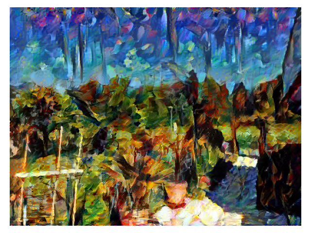
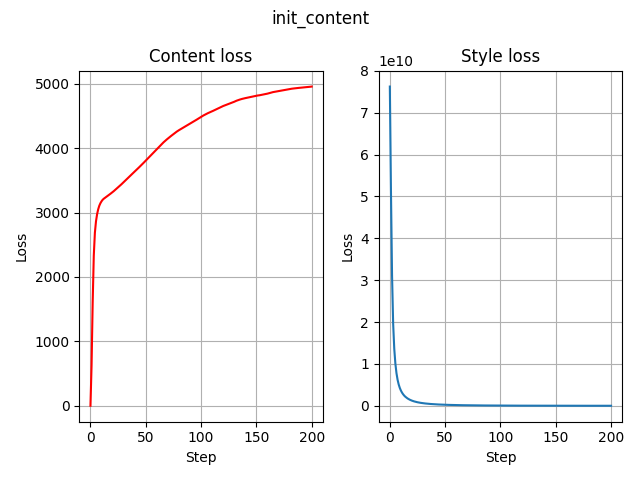
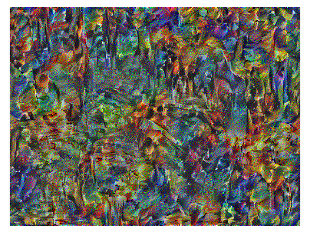
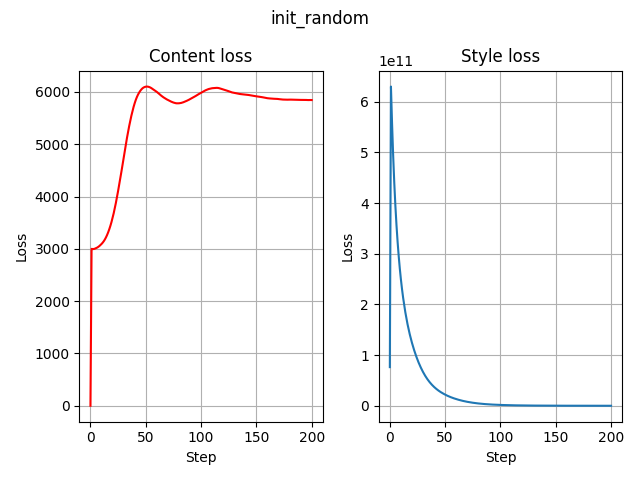

# Neural Style Transfer
by Tim Niklas Witte

An implementation of the [Neural Style Transfer](https://www.cv-foundation.org/openaccess/content_cvpr_2016/papers/Gatys_Image_Style_Transfer_CVPR_2016_paper.pdf) algorithm introduced by Leon A. Gatys et. al. in TensorFlow.

For demonstration purpose, the style depicted in the style image (Night Alley by Leonid Afremov) is transferred to the content image (picture of my garden 😅).
The [Neural Style Transfer](https://www.cv-foundation.org/openaccess/content_cvpr_2016/papers/Gatys_Image_Style_Transfer_CVPR_2016_paper.pdf) paper proposes to start with white noise (init_random).
In this example, this results into a "bad" combination (see evaluation).
As a consequence, the content image has been used as inital image (init_content).

# Evaluation
## Content image


## Style image


## Combination of content image and style image
### Initial image = content image (init_content)




### Initial noise = white noise (init_random)




# Usage
Note, this repository is used as additional lecture material of the Implementing ANNs with TensorFlow
course of the Osnabrück University (winter semester 2023/24).
In order to make the code easier to understand, parameterization of the code via runtime arguments (terminal) has been avoided.

Start the training (create image: the artistic style captured in style image image is transferred onto the content image)

```
python3 Training.py
```

## Overview of directories
- `./images`: contains content and style images
- `./logs`: TensorBoard logs
- `./plots`: Content and style loss plots (init_content and init_random) and loaded images from
the TensorBoard logs as `X.png` files at each step. `X` indicates the step number.
- `./plotting scripts`: Creating the content and style loss plots and loading the images from the TensorBoard logs

# Requirements
- TensorFlow 2
- TensorboardX
- matplotlib
- tqdm
- seaborn
- pandas
- Numpy
